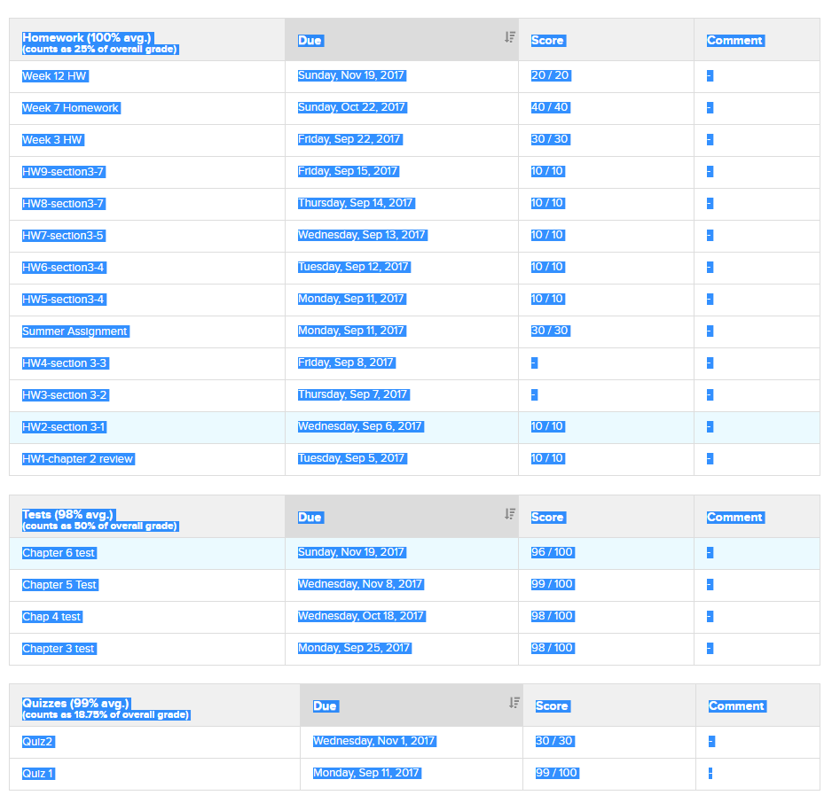

# engradepro_score_calculator
Calculates EngradePro scores from raw data.

## Requirements
* Python 3

## Usage
Select all data from the top heading of the first table to the bottom of the last table and copy it into a text file.

Selection example:



Example of data in ```example_data.txt```.

Then run the .py file and follow the instructions.

``` bash
python3 calculate.py
```
